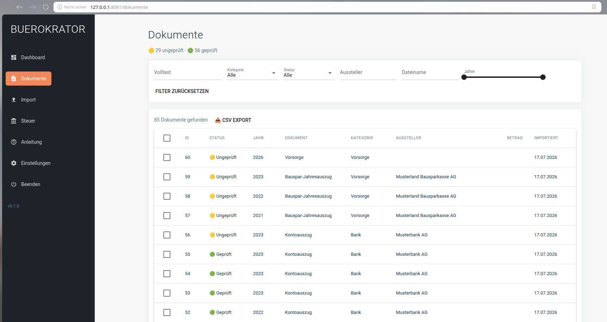
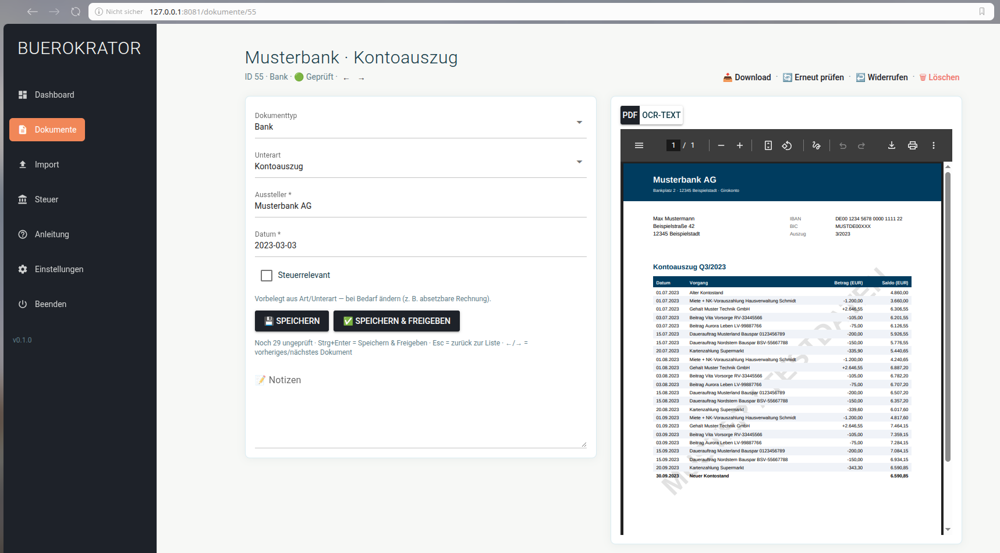

# Buerokrator

Version 0.2.1 — öffentliche Vorabversion ([Änderungen](CHANGELOG.md)).

Buerokrator automatisiert die private Dokumentenablage und unterstützt bei der
Vorbereitung der jährlichen Steuererklärung — **vollständig lokal, ohne Cloud**.

Neue Dokumente landen in einem Eingangsordner, werden per OCR gelesen,
klassifiziert, automatisch umbenannt und archiviert; die relevanten Felder
werden in einer lokalen Datenbank gespeichert und in der App geprüft. Keine
Daten verlassen den Rechner — auch keine Web-Fonts.

## Screenshots

*Dokumentenliste mit Filtern und Bulk-Aktionen:*



*Prüf-Workflow: Formular neben der PDF-/OCR-Ansicht (Beispieldokument mit Musterdaten):*



## Hauptfunktionen

- Stapel-Import aus dem `inbox`-Ordner, inklusive Dubletten-Erkennung
- Layouttreue Textextraktion aus digitalen PDFs; OCR für gescannte
  Dokumente (Tesseract)
- Dokumentklassifikation (Regeln zuerst, LLM für unklare Fälle)
- Extraktion steuerrelevanter Felder je Dokumenttyp/-subtyp; amtliche
  Formulare (Lohnsteuerbescheinigung, SV-Meldung, Entgeltnachweis,
  Bauspar-Jahresauszug) liest zusätzlich ein deterministischer Regelparser
- Automatische Umbenennung und Archivierung nach `archive/<Jahr>/<Kategorie>/`
- Prüf-Workflow in der App (Formular neben PDF-/OCR-Ansicht,
  Strg+Enter = Speichern & Freigeben & weiter)
- Hinweis auf inhaltliche Dubletten: derselbe Beleg ein zweites Mal
  eingescannt hat andere Bytes, aber dieselben Werte — der Prüf-Workflow
  verlinkt dann das mögliche Gegenstück, samt der Felder, die dem
  widersprechen (Wertung bleibt beim Nutzer, nichts wird automatisch
  gelöscht)
- Volltextsuche mit Relevanz-Ranking (SQLite FTS5, auch Teilbegriffe)
- Analyse-Seite mit zwei Tabs: „Steuer" mit ELSTER-Anlagen-Ansicht
  (Anlage N, Vorsorgeaufwand, KAP, außergewöhnliche Belastungen, § 35a) —
  pro Position Ampel und Beleg-Herleitung, in Summen fließen nur geprüfte
  Dokumente, dazu Jahresübersicht + CSV-Export; „Einkommen" mit
  Jahreseinkommens-Diagramm (Brutto, Steuern, rechnerisches Netto) aus den
  geprüften Lohnsteuerbescheinigungen
- Aussteller-Aliase: verschiedene Schreibweisen desselben Ausstellers
  werden schon beim Import vereinheitlicht — pflegbar in der App
  (*Einstellungen → Aliase*) oder als Textdatei
- Löschen in den Papierkorb statt endgültig
- Backup von Datenbank + Archiv als ZIP auf Knopfdruck (inkl.
  Wiederherstellung)

## Voraussetzungen

Alle Werkzeuge laufen lokal:

- **Python 3.12+**
- **Tesseract OCR** mit den Sprachpaketen `deu` und `eng`
  (Ubuntu/Debian: `sudo apt install tesseract-ocr tesseract-ocr-deu`)
- **pypdfium2** für PDF-Text und die Umwandlung gescannter Seiten in
  Bilder (wird als Python-Paket über `requirements.txt` mitinstalliert)
- *Optional, empfohlen:* **[Ollama](https://ollama.com/)** mit einem
  Sprachmodell (Standard `gemma3:4b`): `ollama pull gemma3:4b`.
  Ohne Ollama läuft der Import im eingeschränkten Modus: Dokumente werden
  per OCR gelesen und archiviert, eindeutige Typen erkennt der
  Regel-Klassifikator — aber es werden keine Felder automatisch
  ausgelesen; Typ und Werte trägt man dann im Prüf-Workflow von Hand nach
  (oder später per „Erneut prüfen“, sobald Ollama läuft).

Der plattformabhängige Pfad zu Tesseract steht in
`config/settings.yaml`. Ob alles verfügbar ist, zeigt in der App
*Einstellungen → Konfiguration → Systemstatus*.

## Installation als Desktop-Anwendung (Linux)

Aus dem Release-Tarball (`buerokrator-<version>-linux-<arch>.tar.gz`,
selbst baubar, siehe *Entwicklung*) — installiert ohne root für den
aktuellen Benutzer und legt einen Menüeintrag an:

```bash
tar xzf buerokrator-0.2.1-linux-x86_64.tar.gz
cd buerokrator-0.2.1-linux-x86_64
./install.sh
```

Start über das Anwendungsmenü oder `~/.local/bin/buerokrator` — die App
öffnet sich im Browser. Beim ersten Start führt ein Einrichtungsassistent
durch Systemcheck und Speicherorte. Beenden über
*Einstellungen → Konfiguration → Anwendung → Beenden*.

Das Schließen des Browser-Tabs beendet die App **nicht** (dafür ist der
Beenden-Knopf da); ein erneuter Start öffnet dann einfach wieder die schon
laufende Instanz.

Tesseract (erforderlich) und Ollama (optional, siehe *Voraussetzungen*)
bleiben auch beim Paket Systemabhängigkeiten. Alle Nutzerdaten liegen getrennt vom Programm in
`~/.local/share/buerokrator`; zum Entfernen genügt das Löschen von
`~/.local/opt/buerokrator`, dem Symlink `~/.local/bin/buerokrator` und
dem Menüeintrag `~/.local/share/applications/buerokrator.desktop`.

## Installation aus dem Quellcode

```bash
git clone https://github.com/fltdpl/buerokrator.git
cd buerokrator

python -m venv .venv
source .venv/bin/activate        # Windows: .venv\Scripts\activate
pip install -r requirements.txt
```

## Start (Quellcode)

```bash
python -m src.frontend.main      # App unter http://localhost:8081
python main.py                   # dasselbe, kürzer
```

Datenbank und Datenordner werden automatisch angelegt; bei einer frischen
Instanz startet der Einrichtungsassistent (`/einrichtung`).
Eine Kurzanleitung findest du in der App unter *Anleitung*.

## Entwicklung

```bash
python -m pytest -q                  # Testsuite
python -m tools.evaluate --limit 40  # Qualitätsmessung gegen geprüfte Dokumente
python -m tools.tax_check 2025       # Steuerwerte gegen die eigene Erklärung
bash packaging/build_linux.sh        # Linux-Release-Tarball bauen (dist/)
```

Die Versionsnummer steht ausschließlich in `src/__init__.py`; der
Build-Aufruf liest sie von dort. Änderungen je Release stehen in
[CHANGELOG.md](CHANGELOG.md).

## Technik

Pipeline: `inbox` → OCR (`src/ocr`) → Klassifikation (`src/classifier`) →
Extraktion → Organizer (`src/organizer`) → Datenbank (`src/database`);
Steuer-Auswertung in `src/tax`. Die Oberfläche (`src/frontend`, NiceGUI)
enthält Darstellung und Event-Verdrahtung; die Fachlogik liegt
framework-frei und getestet in `src/services`, einfache Lesezugriffe gehen
direkt an `src/database`.

Weiterführende Dokumentation liegt im Ordner `docs/`.

## Datenschutz

Persönliche Dokumente werden nicht versioniert. Von Git ausgeschlossen sind
u. a. `inbox/`, `archive/`, `exports/`, `database/`, `trash/`, `backups/` und
`logs/`.

## Lizenz

[MIT](LICENSE)
