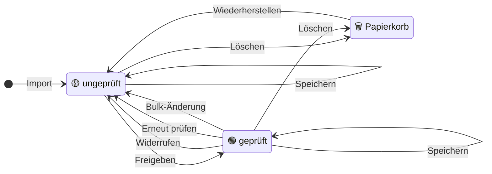

# Prüfworkflow

Der Import liefert einen Vorschlag, keine Wahrheit. Erst die Freigabe
(`verified = 1`) macht daraus einen belastbaren Datensatz — an ihr hängen die
[Steuersummen](04_Steuerlogik.md), das Aussteller-Gedächtnis und die
Qualitätsmessung. Sie ist deshalb immer eine bewusste Handlung, nie ein
Nebeneffekt.

## Zustände

„💾 Speichern" lässt den Status, wie er ist, „✅ Speichern & Freigeben" setzt
ihn und springt weiter; geschrieben wird das Flag nur in
`set_document_verified.py`. „Erneut prüfen" verwirft zusätzlich den
Steuerrelevanz-Override. Der Papierkorb ist kein Flag: die Zeile ist weg, die
Datei liegt in `trash/`.

## Auf der Prüfseite

Die Hinweise stehen bewusst vor der Entscheidung — mögliche Dublette
(`duplicate_service.py`) und unerwarteter Typ (`issuer_memory.py`); beide
ändern nie etwas von selbst. Welche Felder erscheinen, entscheiden Typ **und**
Unterart (`form_schema.py`); leere Pflichtfelder werden nur hervorgehoben und
blockieren nichts. Gespeichert wird über `merge_form_values` →
`whitelist_fields` (trimmen, Datum deutsch, Unterart ans Vokabular binden,
fremde Felder verwerfen) → `enforce_amount_signs` → `rename_document` →
`update_document`.
